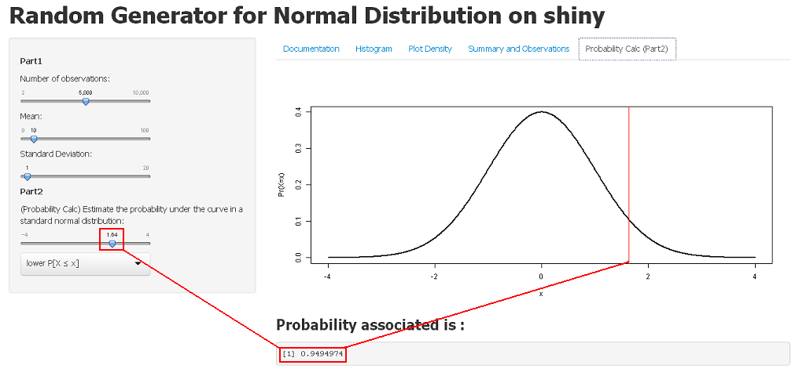

In this simple app you will find a series of tabs that allow you to browse some features related to a set of specific data.

This shiny app takes only two illustrative process and separating the slide in 2 parts.

In __Part 1__: according to a set of data generated in a random manner and size you choose between 2 and 10000 random numbers with normal distribution with mean mu and standard deviation sigma, defaults are the slides at 5000 points, mu = 10 and sigma = 1.


For example:
```{r}
set.seed(1)
dist<-rnorm(5000,10,1)
hist(dist,main="Histogram of Random Points",50)
```

We can see in each flap part of data analysis, for the first part we have the flaps: 
Histogram: the histogram of the respective amount of generated data is performed randomly. 
Plot Density: the density graph randomly generated data is performed, a series of further lines of colors that describe the shape of the distribution as are some quantiles and mean of the data generated are plotted. 
Summary and Observations: a quick summary of the data is generated and can see each of the values. which are based on the analysis presented above.

for the second part __Part2__ from the application of shiny:

we have 1 slide and a button which will allow us to calculate the probability value under the standard normal curve distribution. 

This function allows us to know what is the cumulative probability assigned to a data value in a normal distribution-standard, plus the button allows you to choose the direction in which the probability calculation is performed either
P[X ≤ x] or to P[X > x].

******



